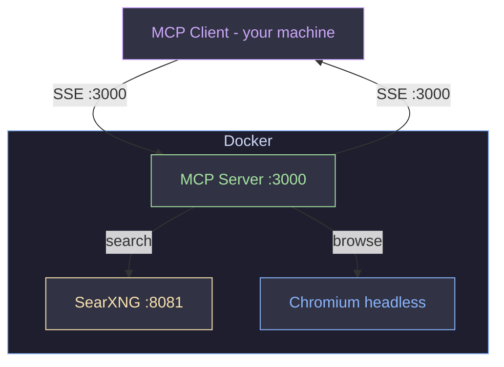

<div align="center">

# 🔍 MCP Web Search Server

**Docker-based MCP server — web search + headless browser**
*Works with any MCP-compatible LLM client*


</div>

---

## 🏗️ Architecture



| Service | Port | Description |
|:--------|:----:|:------------|
| 🔎 SearXNG | `8081` | Private search engine instance |
| 🌐 MCP | `3000` | Unified MCP server — search + browser tools via SSE |

---

## 📋 Requirements

- [Docker](https://docs.docker.com/get-docker/) & Docker Compose
- Python 3.x (for `deploy.py`)
- Any MCP-compatible client (LM Studio, Claude Desktop, Cursor, Continue, etc.)

---

## 🚀 Quick Start

#### 1️⃣ Create `.env`

```bash
echo "SEARXNG_SECRET=$(openssl rand -hex 32)" > .env
```

#### 2️⃣ Deploy

```bash
python3 deploy.py --start
```

#### 3️⃣ Connect your MCP client

Point any MCP-compatible client to: `http://localhost:3000/sse`

> [!WARNING]
> **After restarting the MCP container**, reconnect the MCP server in your client to avoid `-32602 Invalid request parameters` session errors.

---

## 🛠️ MCP Tools

Endpoint: `localhost:3000/sse`

| Tool | Description |
|:-----|:------------|
| 🔎 `search` | **Default tool.** Query SearXNG → titles, URLs, snippets. Fast (~1s). |
| 📖 `deep_search` | Search → fetch full rendered page content with Playwright. Use when snippets aren't enough. |
| 🧭 `navigate` | Fetch a single URL — text (default) or raw HTML (`format='html'`). |
| 📸 `screenshot` | Capture a screenshot of a page (returned as image). |
| 🔗 `extract_links` | Extract all hyperlinks from a page. |
| ✂️ `extract_text` | Extract text from a specific CSS selector on a page. |
| 📰 `headlines` | Extract all headings (h1–h6) from a page. |

<details>
<summary>📋 <code>search</code> parameters</summary>

| Parameter | Default | Description |
|:----------|:-------:|:------------|
| `query` | — | Search query |
| `categories` | `general` | `general`, `news`, `science`, `images`, `videos`, `it`, etc. |
| `language` | `auto` | Language code (`en`, `zh`, …) or `auto` |
| `safe_search` | `0` | `0` off · `1` moderate · `2` strict |
| `max_results` | `10` | Number of results (1–20) |

</details>

<details>
<summary>📋 <code>deep_search</code> parameters</summary>

| Parameter | Default | Description |
|:----------|:-------:|:------------|
| `query` | — | Search query |
| `categories` | `general` | `general`, `news`, `science`, `images`, `videos`, `it`, etc. |
| `language` | `auto` | Language code (`en`, `zh`, …) or `auto` |
| `safe_search` | `0` | `0` off · `1` moderate · `2` strict |
| `max_results` | `3` | Pages to fetch (1–5). Higher = richer but slower. |

</details>

---

## 📦 Commands

```bash
python3 deploy.py --start            # 🟢 Start containers (skips build if image exists)
python3 deploy.py --rebuild          # 🔨 Force rebuild MCP image, then start
python3 deploy.py --stop             # 🔴 Stop and remove containers
python3 deploy.py --logs             # 📜 Stream logs (Enter/Space to stop)
python3 deploy.py --start --logs     # 🟢📜 Start + stream logs
```

---

## 📜 View Logs

```bash
docker logs -f searxng    # SearXNG engine
docker logs -f mcp        # MCP server
```

---

## 🔄 Update server.py without rebuilding

> [!TIP]
> `server.py` and `web_core.py` are mounted as volumes — code changes take effect with a simple restart, no rebuild needed.

```bash
docker restart mcp
```

Only rebuild when `Dockerfile` or `requirements.txt` changes:

```bash
python3 deploy.py --rebuild
```

---

## ⚙️ Environment Variables

| Variable | Default | Description |
|:---------|:-------:|:------------|
| `SEARXNG_URL` | `http://searxng:8080` | Internal SearXNG endpoint |
| `SEARXNG_TIMEOUT` | `15` | HTTP timeout (seconds) |
| `PAGE_TIMEOUT` | `15000` | Playwright navigation timeout (ms) |
| `FETCH_CONCURRENCY` | `5` | Parallel page fetches in `deep_search` |

> The MCP container is configured with `shm_size: 512m` to give Chromium enough shared memory. The Docker default (64 MB) causes renderer crashes.

## Project Structure

```
├── deploy.py              # Deployment script
├── docker-compose.yml     # Container orchestration
├── .env                   # SEARXNG_SECRET (create manually)
├── mcp/
│   ├── server.py          # MCP tools (FastMCP adapter)
│   ├── web_core.py        # Shared browser + search core
│   ├── requirements.txt
│   ├── Dockerfile
│   └── .dockerignore
└── searxng/
    └── settings.yml       # SearXNG engine configuration
```


