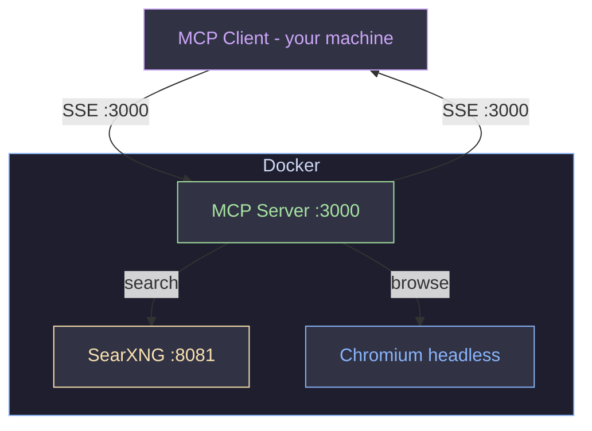

<div align="center">

# 🔍 MCP Web Search Server

**Docker-based MCP server — web search + headless browser**


</div>

---

## 🏗️ Architecture



| Service | Port | Description |
|:--------|:----:|:------------|
| SearXNG | `8081` | Private search engine |
| MCP | `3000` | Search + browser tools via SSE |

---

## � Requirements

- [Docker](https://docs.docker.com/get-docker/) & Docker Compose
- Python 3.x (for `deploy.py`)
- Any MCP-compatible client (Claude Desktop, Cursor, Continue, etc.)

---

## �🚀 Quick Start

```bash
echo "SEARXNG_SECRET=$(openssl rand -hex 32)" > .env
python3 deploy.py --start
```

Connect any MCP client to: `http://localhost:3000/sse`

> [!WARNING]
> After restarting the MCP container, reconnect your client to avoid `-32602` session errors.

---

## 🛠️ Tools

| Tool | Description |
|:-----|:------------|
| `search` | **Default.** SearXNG snippets, sorted by score (~9s) |
| `deep_search` | Snippets + full page content via Playwright |
| `navigate` | Fetch a URL as text or raw HTML |
| `screenshot` | Capture a page as an image |
| `extract_links` | All hyperlinks from a page |
| `extract_text` | Text from a CSS selector |
| `headlines` | All h1–h6 headings from a page |

<details>
<summary>Parameters — <code>search</code> / <code>deep_search</code></summary>

| Parameter | Default | Values |
|:----------|:-------:|:-------|
| `query` | — | Search string |
| `categories` | `general` | `general` `news` `science` `it` `images` `videos` |
| `language` | `auto` | `en` `zh` `ja` … or `auto` |
| `safe_search` | `0` | `0` off · `1` moderate · `2` strict |
| `time_range` | `""` | `""` · `day` · `week` · `month` · `year` |
| `max_results` | `10` / `3` | 1–20 for search · 1–10 for deep_search |

</details>

---

## 📦 Commands

```bash
python3 deploy.py --start        # Start (skips rebuild if image exists)
python3 deploy.py --rebuild      # Force rebuild, then start
python3 deploy.py --stop         # Stop and remove containers
python3 deploy.py --logs         # Stream logs
python3 deploy.py --start --logs # Start + stream logs
```

`server.py` and `web_core.py` are volume-mounted — `docker restart mcp` applies changes without a rebuild.

---

## ⚙️ Environment Variables

| Variable | Default | Description |
|:---------|:-------:|:------------|
| `SEARXNG_URL` | `http://searxng:8080` | Internal SearXNG endpoint |
| `SEARXNG_TIMEOUT` | `25` | httpx timeout (s) — must exceed `max_request_timeout` in `settings.yml` |
| `PAGE_TIMEOUT` | `15000` | Playwright timeout (ms) |
| `FETCH_CONCURRENCY` | `5` | Parallel fetches in `deep_search` |

> `shm_size: 512m` is required for Chromium — the Docker default (64 MB) causes crashes.

---

## 📁 Project Structure

```
├── deploy.py                  # Deployment helper
├── docker-compose.yml         # Container orchestration
├── mcp-lmstudio-config.json   # LM Studio MCP client config
├── .env                       # SEARXNG_SECRET (create manually)
├── mcp/
│   ├── server.py              # MCP tools (FastMCP)
│   ├── web_core.py            # Search + browser core
│   ├── Dockerfile
│   └── requirements.txt
└── searxng/
    └── settings.yml           # Engine config + timeout tuning
```


